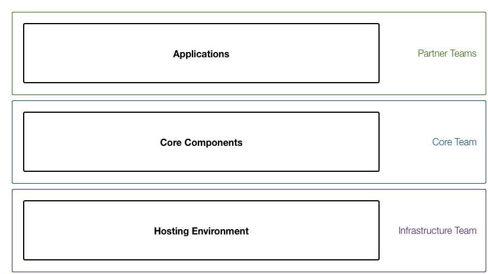

=============================================
Girl Effect Core Infrastructure Documentation
=============================================

Introduction
============

The Girl Effect Core Infrastructure project is a multi-stage endeavour to consolidate the hosting, data storage and data analysis needs for the entire Girl Effect digital ecosystem, along with providing tools and services that codify our values, goals and best practices.

The Core Infrastructure project will form the shared base of all of Girl Effect's current and future digital platforms. This will enable Girl Effect's teams and application partners to quickly roll out new platforms and services across the globe in a rapid and scalable way while ensuring our user's data privacy and security.

There are three main layers to the Core Infrastructure project:

    Core Infrastructure Layers

Applications
    The application layer is the top most layer and builds on the Core Components and Hosting Environment. This layer is where all the Girl Effect digital applications and services will run, whether they are developed internally at Girl Effect or with outside partners. 
    
    The applications in this layer are expected to leverage the functionality provided by the Core Components and Hosting Environment to enable quick roll out, rapid iteration and easy scaling.

:doc:`Core Components <core-components>`
    The Core Component layer builds on the Hosting Environment layer to provide the shared functionality that all the applications can make use of.

    Some of the initial functionality that will be provided by the Core Components is: safe user data storage, authorisation and access control; user and system event logging; platform-wide data analysis; platform-wide media asset management.

:doc:`Hosting Environment <hosting/index>`
    The Hosting Environment layer is the base that the other two layers build on top of. This layer is where all the hosting resources are consolidated into a single system that provides security, scalability, fault tolerance and simplified usage for both the Core Component and Application developers.

Details
-------

One of the main goals of the Core Infrastructure project is to make it possible to rapidly build and deploy scalable applications that still protect our user's data and privacy. To help get application developers up to speed, we provide the following documentation:

* A :ref:`technical overview of our Hosting Environment <hosting-overview>`, including the :ref:`key technologies <hosting-key-technologies>` we have chosen
* A :ref:`reference guide to the technologies needing to be adopted <hosting-requirements>` to run applications in our Hosting Environment
* :doc:`Detailed descriptions of the Core Components <core-components>`, :ref:`the APIs they provide <core-components-apis>` and an :ref:`adoption and best practice guide <core-components-guide>`.
* Development best practices that we follow
* Our support and escalations procedures

.. toctree::
    :maxdepth: 2
    :hidden:

    hosting/index
    core-components
    development-best-practices
    support-escalation